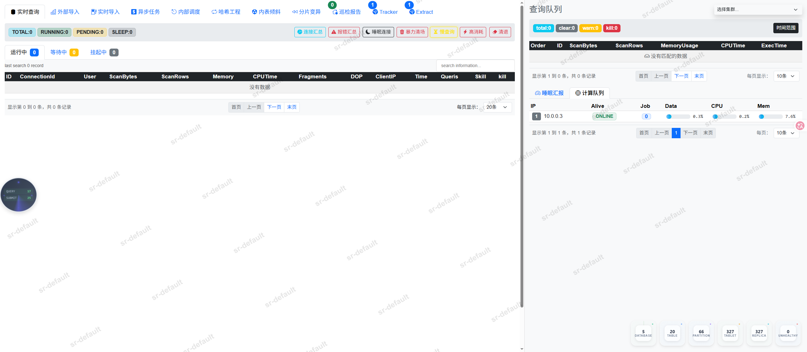

<div style="text-align: center;">
<h1>StarRocksProbe</h1>


</div>


**简介**

StarRocks Probe（星辰守望）是一款专为StarRocks分布式分析型数据库（OLAP）打造的一站式可视化运维监控、性能诊断与资源管控平台。
平台采用双屏联动的操作界面，将复杂的集群底层状态转化为直观的数据可视化视图，涵盖实时查询治理、多途径数据导入监控、集群元数据倾斜诊断、算力节点消耗追踪以及自动化巡检等功能，旨在帮助我们运维工程师高效管控集群、快速定位性能瓶颈、保障StarRocks的稳定与高效运行。
### 亮点

- **📌 实时查询监控** - 实时统计与展示 `TOTAL`、`RUNNING`、`PENDING`、`SLEEP` 等各种状态的查询连接数。
- **🔥 快捷运维治理** - 支持`慢查询查杀`、`高消耗熔断`、`睡眠连接清理`、`暴力清场`。
- **📊 透视报错汇总** - 支持`查询`、`导入`报错收集，提供一键式连接饼图汇总与报错详情检索，快速定位客户端连接来源与报错原因。
- **✨ 全途径导入与任务调度监控** - 支持监控`外部导入`、`实时导入`、`异步任务`、`内部调度`。
- **🚀 元数据倾斜与集群健康诊断** - 支持`内表数据倾斜检测`、`分片变异与副本监控`、`哈希工程与安全`。
- **🌟 资源队列与计算节点监测项** - 支持`实时查询资源消耗榜`、`计算队列`、`睡眠汇报`。

### 适用场景
- **运维巡检**：日常排查慢查询，精准处理灾难语句，集群健康度检查、副本状态核查与资源监控。
- **查询分析**：排查高延迟、高CPU/内存消耗的业务查询，抓取Profile进行执行计划分析。
- **导入监控**：实时监控ETL及导入管道的稳定度与报错原因。
- **倾斜治理**：展示集群分片倾斜度与负载均衡。


## 快速开始

### 步骤一：数据库

```bash
# 1. 部署mysql数据库，并创建数据表
CREATE TABLE `starrocks_information_connections` (
  `app` varchar(100) NOT NULL COMMENT '集群名称(英文)',
  `nickname` varchar(100) NOT NULL COMMENT '别名',
  `alias` varchar(100) DEFAULT NULL COMMENT '集群别名',
  `feip` varchar(200) NOT NULL COMMENT '集群连接地址(必填)F5,VIP,CLB,FE',
  `user` varchar(200) NOT NULL COMMENT '集群登录账号(必填) 建议是管理员角色的账号',
  `password` varchar(500) NOT NULL COMMENT '集群登录密码(必填)',
  `feport` int(11) NOT NULL DEFAULT '9030' COMMENT '集群登录端口，默认9030',
  `status` int(11) NOT NULL DEFAULT '1' COMMENT '配置生效开关,0 off, 1 on',
  `meta_user` varchar(100) DEFAULT NULL COMMENT '商业版 mysql元数据的用户名',
  `meta_pass` varchar(200) DEFAULT NULL COMMENT '商业版 mysql元数据的密码',
  `meta_host` varchar(200) DEFAULT NULL COMMENT '商业版 mysql元数据的地址',
  `fe_log_path` varchar(500) DEFAULT NULL COMMENT 'FE日志目录路径',
  `be_log_path` varchar(500) DEFAULT NULL COMMENT 'BE日志目录路径',
  `updated_at` timestamp NULL DEFAULT CURRENT_TIMESTAMP ON UPDATE CURRENT_TIMESTAMP COMMENT '更新时间'
) ENGINE=InnoDB DEFAULT CHARSET=utf8mb4 COMMENT='StarRocks'

# 2. 插入数据
INSERT INTO chengken.starrocks_information_connections (`app`, `nickname`, `alias`, `feip`, `user`, `password`, `feport`, `status`, `meta_user`, `meta_pass`, `meta_host`, `fe_log_path`, `be_log_path`) VALUES ('sr-qa', '腾讯云', 'dev', '192.168.1.1', 'root', '123456', 9030, 1, '', '', '', '/starrocks/fe-*/log', '/starrocks/be-*/log');

# 3. 配置稽核
检查插入的数据必须准确，否则集群连接失败

```


### 步骤二：配置文件

```bash
# 1. 【精简版】配置文件.StarRocksProbe.yaml，填写配置，二选一
metadb:
  host: 127.0.0.1
  port: 3306
  user: root
  password: xxxx
  base: chengken.starrocks_information_connections

server:
  port: 19321
  token: "123456"
  loadhtmlglob: /chengken/templates/html/*.html
  loadstatic: /chengken/templates/static

log:
  path: '/u/users/svccndlopsns/chengken/log'
  
# 2. 【完整版】配置文件.StarRocksProbe.yaml，填写配置，二选一
metadb:
  host: 127.0.0.1                                                   #mysql地址
  port: 3306                                                        #mysql端口
  user: root                                                        #mysql账号
  password: xxxxxxxxxxxx                                            #mysql密码
  base: chengken.starrocks_information_connections                  #mysql配置表

server:
  port: 19321                                                       #服务端口
  token: "123456"                                                   #登录token，登陆方式：123456+当前日期，比如今天是20260401，那么登录密码就是：1234560401
  sshuser: starrocks                                                #巡检报告，免密到fe和be
  loadhtmlglob: /chengken/templates/html/*.html                     #静态页面
  loadstatic: /chengken/templates/static                            #静态资源


schema:
  auditops: audit.starrocks_audit_log                               #审计表
  filter_errmsg: 'unknown thread id|unknown resource group|detail message: unknown user|cannot find user'  #企业版功能
  whiteip:                                                          #登录白名单IP
    - 10.10.10.10
    - 10.10.10.11
category:                                                           #商业版功能
  0:
  1:
    - 'rpc failed'
    - 'since transaction status unknown'
    - 'Commit failed'
    - 'crash of backends'
    - 'Not connected to'
    - 'Fe abort the task'
    - 'no associated load channel'
    - 'Failed to lock database'
    - 'Broker storage service error'
    - 'only found column statistics'
    - 'Table creation timed out'
    - 'HdfsOrcScanner'
    - 'ORC reader read file'
    - 'Query has been cancelled'

  2:
    - 'is not found'
    - 'cannot be resolved'
    - 'Unknown user'
    - 'Unknown table'
    - 'Unknown database'
    - 'Access denied'
    - 'type:LOAD_RUN_FAIL; msg:Cancelled'
    - 'Mem usage has exceed the limit of single query'
    - 'please check trackingSQL'
    - 'is not active'
    - 'Memory'
    - 'column count'
    - 'cannot find user'
    - 'truncate a file by broker'
    - ' column '
    - 'select tracking_log'
    - 'already exists'
    - 'No database selected'
    - 'Unknown partition'
    - 'Unsupported insert overwrite hive unpartitioned'
    - 'table not found'
    - 'KILL QUERY'
    - 'A schema change operation is in progress'
    - 'Type (nested) percentile/hll/bitmap/json not'
    - 'Connection reset by peer'
    - 'exceed big query'
    - 'Getting analyzing error'
    - 'killed by kill statement'
    - 'max_automatic_partition_number'


log:
  path: '/u/users/svccndlopsns/chengken/log'

```


### 步骤三：运行

```bash
# 1. 访问项目地址
https://github.com/chengkenli/StarRocksProbe/releases

# 2. 下载最新版 静态资源
templates.zip

# 3. 下载最新版 二进制程序
StarRocksProbe

# 2. 启动服务
./StarRocksProbe 

# 3. 访问应用
web open http://localhost:19321
```


### 初次访问

客户端地址在没有加入白名单之前，需要输入Token才允许访问。

### 主页

查询导入任务监控。

## 其他说明

### StarRocks 用户权限配置(重要)

**在启动程序之前**,配置在mysql表中的账号建议是管理员角色、以及账号需要对集群拥有system权限，否则可能会无法正常发起kill行为。可以使用`root` 账号，程序不会进行任何变更。


## 联系方式与支持

如有任何问题或疑问，欢迎通过邮件、StarRocks中文社区联系我。


