> 星辰守望 - StarRocks小助手2.0 --  来自管理员便捷式管理查询会话

# 简介


这是一个StarRocks集群 对**正在运行**的语句可管理小助手。

一、查询

> 这里的数据来源于用户提交的所有select/insert语句。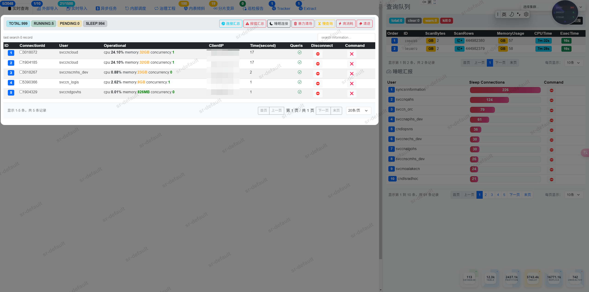

二、导入

> 这里的数据来源于Broker Load类型。
> 
> 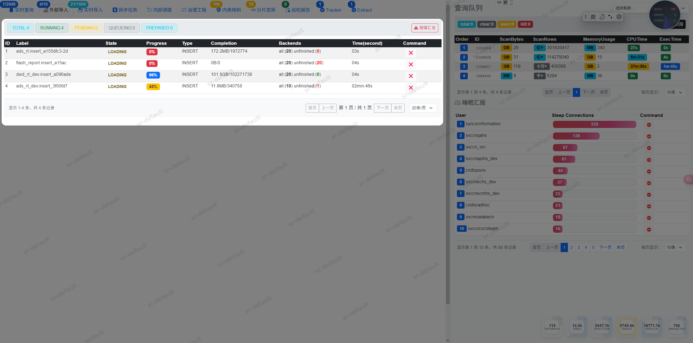

三、实时

> 这里的数据来源于flink类型。
> 
> 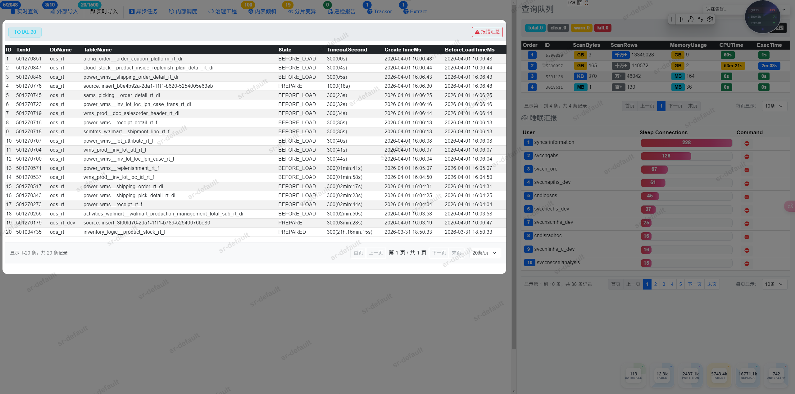

四、异步

> 这里的数据来源于submit、物化视图异步类型。
> 
> 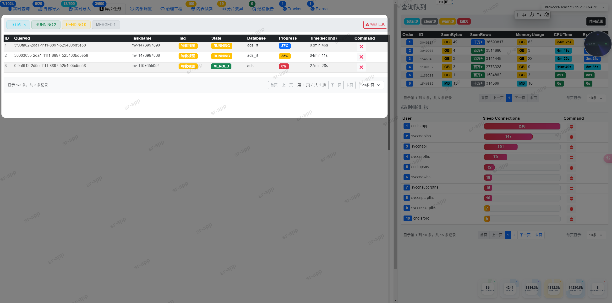

五、内部

> 这里的数据来源于alter类型。
> 
> 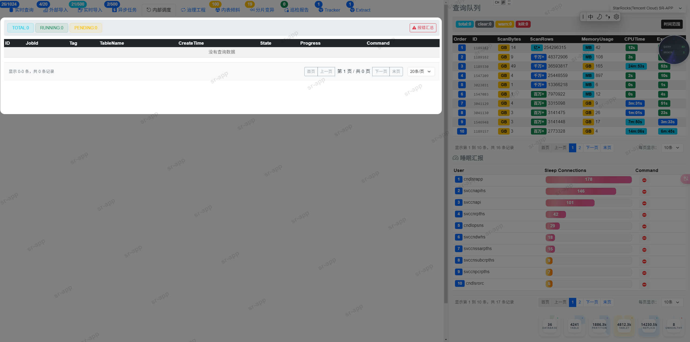

六、分桶

> 这里的数据来源于分区分桶倾斜降序top100。
> 
> 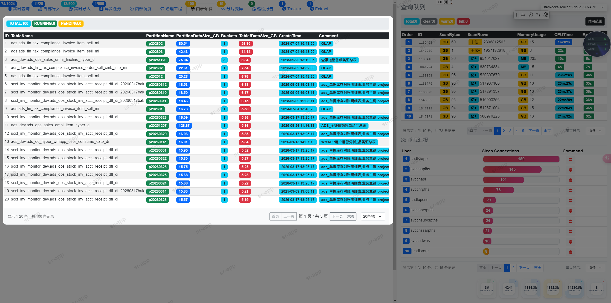

七、分片

> 这里的数据来源于tablet过大降序top35。
> 
> 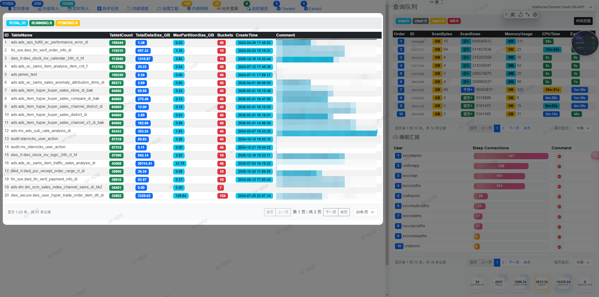

八、巡检

> 生成自动巡检报告，点击后触发后台协程巡检集群状态。
> 
> 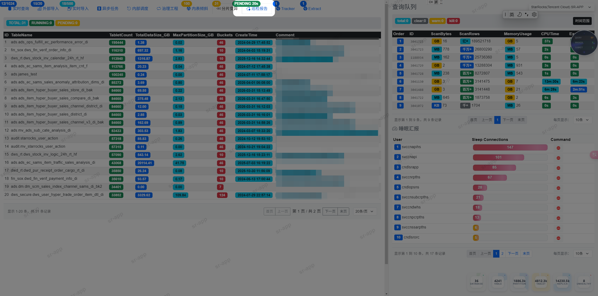
> 
> 直接PENDING转变为FINISHED后，再次点击即可查看集群巡检报告。

九、内存

> 这里的数据来源于mem_tracker接口。
> 
> 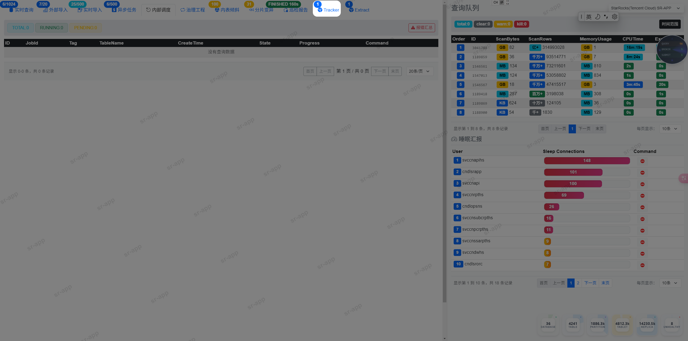

十、查询队列

> 这里的数据来源于查询队列。
> 
> 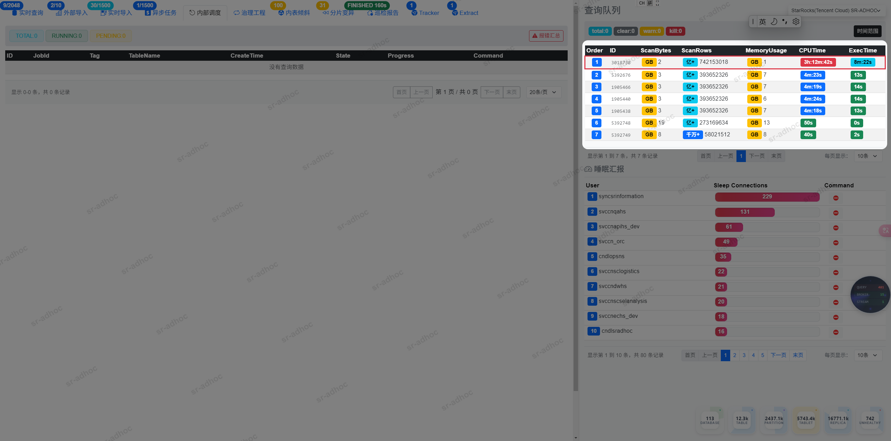

十一、睡眠连接

> 这里的数据来源于sleep连接数汇总。
> 
> 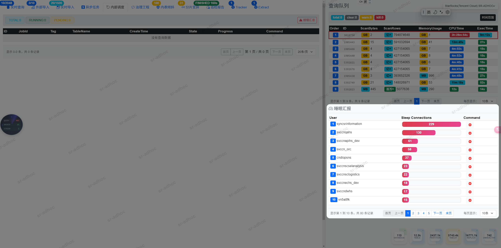

十二、集群元数据

> 这里的数据来源于statistic。
> 
> 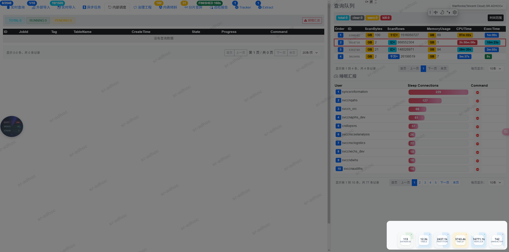

十二、报错采集

> 这里的数据来源于【企业版】MANAGER MYSQL元数据库。
> 
> 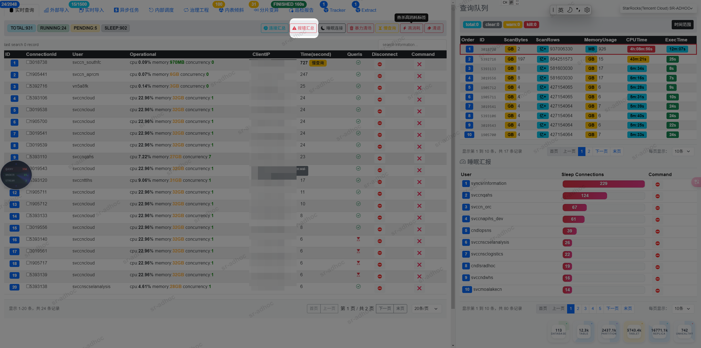
> 
> 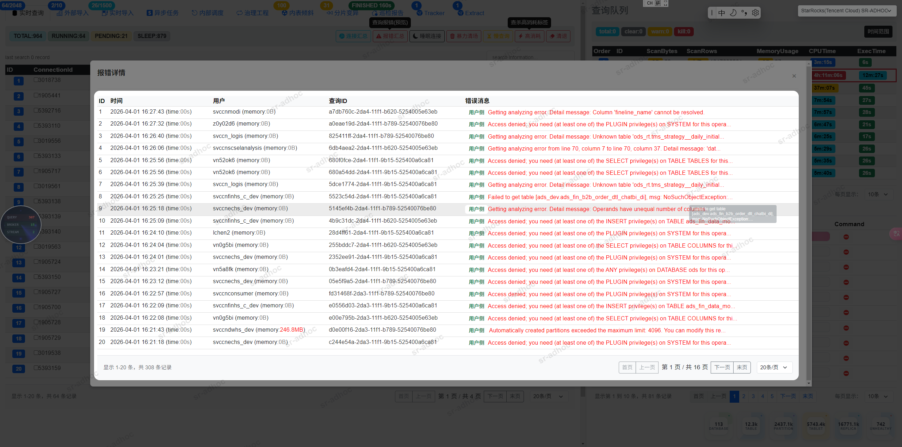
> 
> 除查询报错需要企业版，其他报错汇总社区版可采集。
> 
> 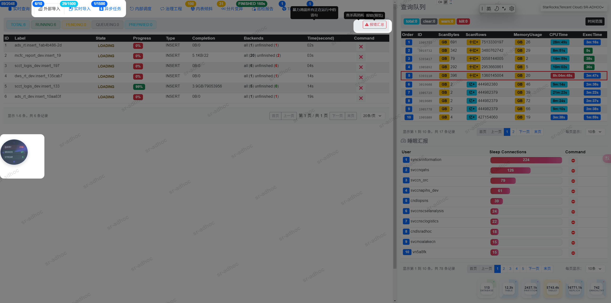

十三、查杀

> 这里的行为主要是用于查杀、清理语句。
> 
> 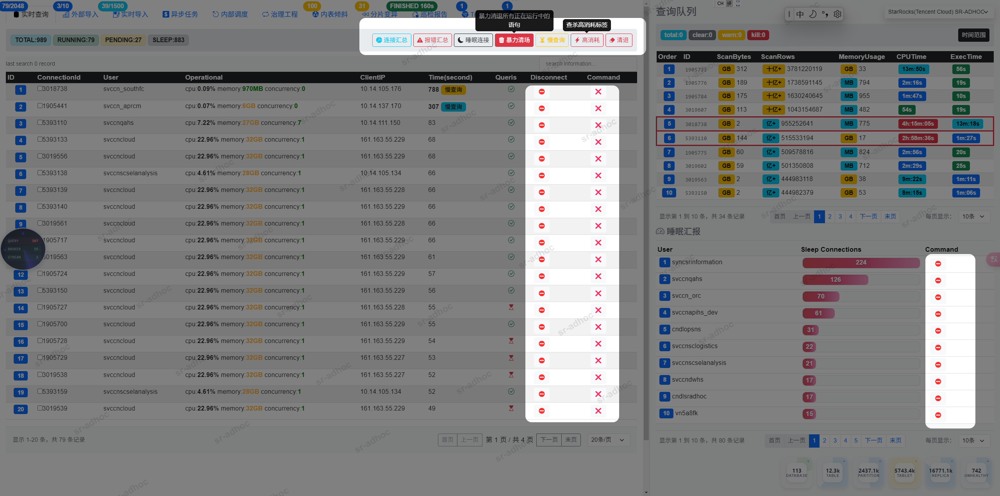

# 操作

一、MYSQL

> 你需要拥有一个mysql库，里面需要有一张表用于填写StarRocks的登录信息，程序通过这个表以获取登录配置。

```
 CREATE TABLE `starrocks_information_connections` (                                                                                            
  `app` varchar(100) CHARACTER SET utf8mb4 COLLATE utf8mb4_0900_ai_ci NOT NULL COMMENT '集群名称(英文)',                                      
  `nickname` varchar(100) CHARACTER SET utf8mb4 COLLATE utf8mb4_0900_ai_ci NOT NULL COMMENT '别名',                                           
  `alias` varchar(100) CHARACTER SET utf8mb4 COLLATE utf8mb4_0900_ai_ci DEFAULT NULL COMMENT '集群别名',                                      
  `feip` varchar(200) CHARACTER SET utf8mb4 COLLATE utf8mb4_0900_ai_ci NOT NULL COMMENT '集群连接地址(必填)F5,VIP,CLB,FE',                    
  `user` varchar(200) CHARACTER SET utf8mb4 COLLATE utf8mb4_0900_ai_ci NOT NULL COMMENT '集群登录账号(必填) 建议是管理员角色的账号',          
  `password` varchar(500) CHARACTER SET utf8mb4 COLLATE utf8mb4_0900_ai_ci NOT NULL COMMENT '集群登录密码(必填)',                             
  `feport` int NOT NULL DEFAULT '9030' COMMENT '集群登录端口，默认9030',                                                                      
  `status` int NOT NULL DEFAULT '0' COMMENT '配置生效开关,0 off, 1 on',                                                                       
  `meta_user` varchar(100) CHARACTER SET utf8mb4 COLLATE utf8mb4_0900_ai_ci DEFAULT NULL COMMENT 'manager元数据的用户名',                     【企业版】MANAGER MYSQL账号，非必填
  `meta_pass` varchar(200) CHARACTER SET utf8mb4 COLLATE utf8mb4_0900_ai_ci DEFAULT NULL COMMENT 'mysql元数据的密码',                         【企业版】MANAGER MYSQL密码，非必填
  `meta_host` varchar(200) CHARACTER SET utf8mb4 COLLATE utf8mb4_0900_ai_ci DEFAULT NULL,                                                     【企业版】MANAGER MYSQL地址，非必填
  `fe_log_path` varchar(500) CHARACTER SET utf8mb4 COLLATE utf8mb4_0900_ai_ci DEFAULT NULL COMMENT 'FE 日志目录',                             【社区版】生成巡检报告需要时需要，/starrocks/fe-*/log/，非必填
  `be_log_path` varchar(500) CHARACTER SET utf8mb4 COLLATE utf8mb4_0900_ai_ci DEFAULT NULL COMMENT 'BE 日志目录',                             【社区版】生成巡检报告需要时需要，/starrocks/be-*/log/，非必填
  `updated_at` timestamp NULL DEFAULT CURRENT_TIMESTAMP ON UPDATE CURRENT_TIMESTAMP COMMENT '更新时间'                                        
) ENGINE=InnoDB DEFAULT CHARSET=utf8mb4 COLLATE=utf8mb4_0900_ai_ci COMMENT='StarRocks登录配置，manager地址,(定期检查license过期日期)';        
```

二、进程

> 你需要将templates文件夹指定到配置文件中，以便程序启动时正常读取。

三、配置

精简版

```
metadb:
  host: 127.0.0.1
  port: 3306
  user: root
  password: **************1.
  base: chengken.starrocks_information_connections

server:
  port: 19321
  token: "123456"
  loadhtmlglob: /u1/dlopsnas/chengken/templates/html/*.html
  loadstatic: /u1/dlopsnas/chengken/templates/static

log:
  path: '/u/users/svccndlopsns/chengken/log'

完整
```

完整版

```
metadb:
  host: 127.0.0.1                                                   #mysql地址
  port: 3306                                                        #mysql端口
  user: root                                                        #mysql账号
  password: **************1.                                            #mysql密码
  base: chengken.starrocks_information_connections                  #mysql配置表

server:
  port: 19321                                                       #服务端口
  token: "123456"                                                   #登录token，登陆方式：123456+当前日期，比如今天是20260401，那么登录密码就是：1234560401
  sshuser: starrocks                                                #巡检报告，免密到fe和be
  loadhtmlglob: /u1/dlopsnas/chengken/templates/html/*.html         #静态页面
  loadstatic: /u1/dlopsnas/chengken/templates/static                #静态资源


schema:
  auditops: audit.starrocks_audit_log                               #审计表
  filter_errmsg: 'unknown thread id|unknown resource group|detail message: unknown user|cannot find user'  #企业版功能
  whiteip:                                                          #登录白名单IP
    - 10.10.10.10
    - 10.10.10.11
category:                                                           #企业版功能
  0:
  1:
    - 'rpc failed'
    - 'since transaction status unknown'
    - 'Commit failed'
    - 'crash of backends'
    - 'Not connected to'
    - 'Fe abort the task'
    - 'no associated load channel'
    - 'Failed to lock database'
    - 'Broker storage service error'
    - 'only found column statistics'
    - 'Table creation timed out'
    - 'HdfsOrcScanner'
    - 'ORC reader read file'
    - 'Query has been cancelled'

  2:
    - 'is not found'
    - 'cannot be resolved'
    - 'Unknown user'
    - 'Unknown table'
    - 'Unknown database'
    - 'Access denied'
    - 'type:LOAD_RUN_FAIL; msg:Cancelled'
    - 'Mem usage has exceed the limit of single query'
    - 'please check trackingSQL'
    - 'is not active'
    - 'Memory'
    - 'column count'
    - 'cannot find user'
    - 'truncate a file by broker'
    - ' column '
    - 'select tracking_log'
    - 'already exists'
    - 'No database selected'
    - 'Unknown partition'
    - 'Unsupported insert overwrite hive unpartitioned'
    - 'table not found'
    - 'KILL QUERY'
    - 'A schema change operation is in progress'
    - 'Type (nested) percentile/hll/bitmap/json not'
    - 'Connection reset by peer'
    - 'exceed big query'
    - 'Getting analyzing error'
    - 'killed by kill statement'
    - 'max_automatic_partition_number'


log:
  path: '/u/users/svccndlopsns/chengken/log'
```
